# Recoding : aux sources du dessin génératif / Stereolux / 2026
This workshop will revisit the seminal works of the pioneers of generative art from the 1960s and 1970s: Colette and Charles Bangart, Manfred Mohr, Frieder Nake, Georg Nees, Michael Noll, Vera Molnár, and others. At a time when computers and plotters were confined to research laboratories, these artists paved the way for new forms of creation using algorithmic material.<br />  

https://stereolux.org/agenda/workshop-recoding-aux-sources-du-dessin-generatif

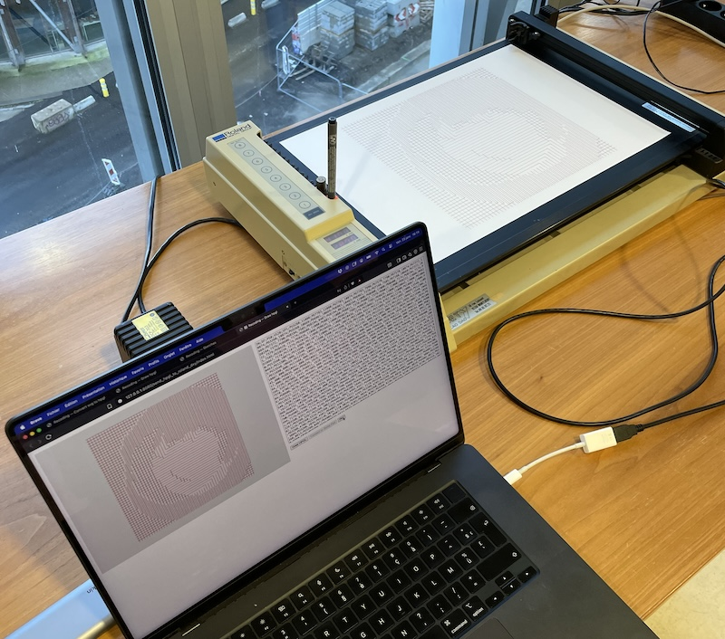

> "We think the image. We don't make it.<br /><br />When we think the image, we always think infinitely many images. That's absolutely new. The algorithmic artist is thus a totally new kind of artist."<br /><br />
— *Frieder Nake*


## Plots
[Thomas](https://www.thomaslanza.com/) recoded and played with [Frieder Nake's Walk through raster](https://collections.vam.ac.uk/item/O214165/walk-through-raster-series-2-photograph-nake-frieder/) algorithm.
<p>

 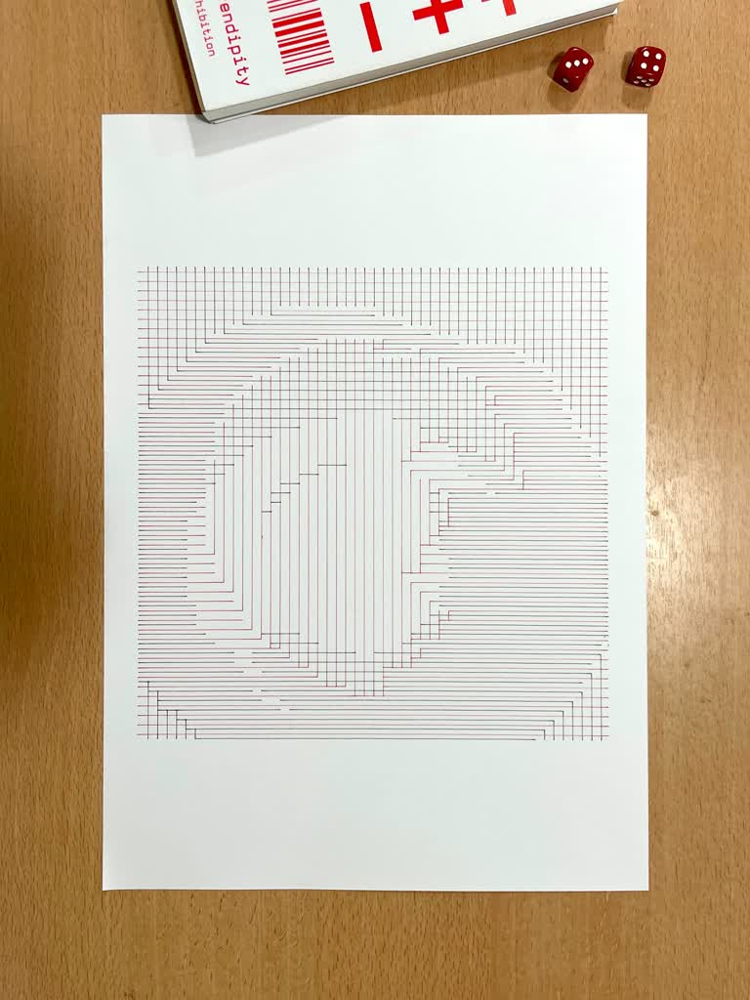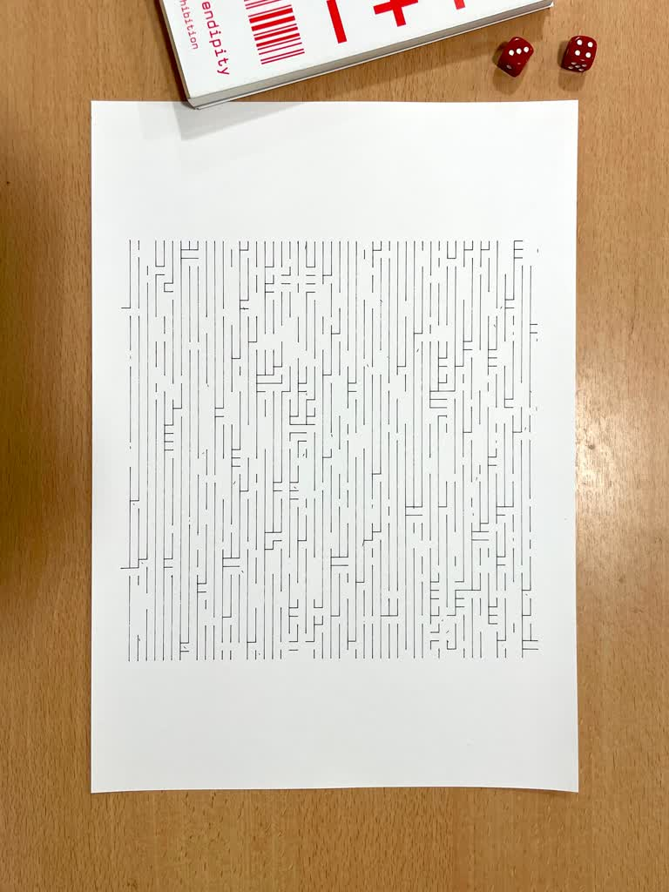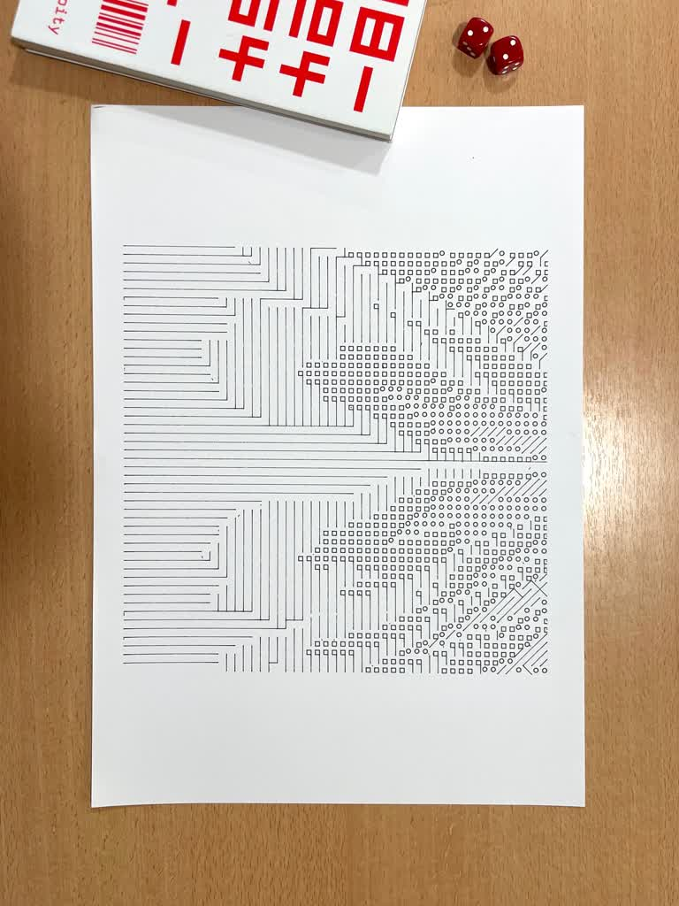
 </p>

****

Olivier jumped into the realm of cubes edges by recreating one of [Manfred Mohr's Cubic Limit](https://www.emohr.com/two_1972.html).
<p>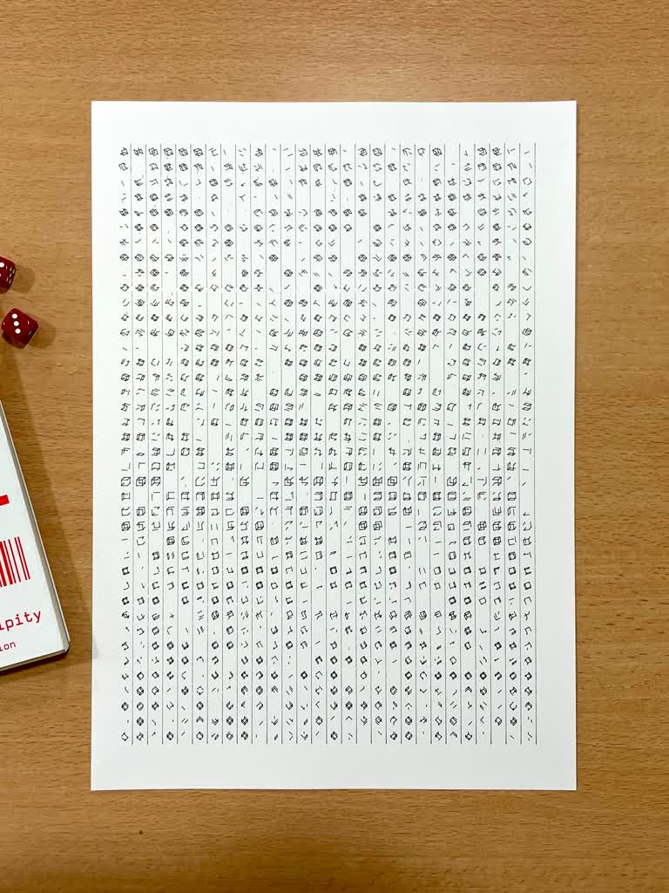</p>

****

[Nicolas](https://nicolasdaniel.com/) was the [James R Warner emerging man](https://web.archive.org/web/20241212145324/http://recodeproject.com/artwork/v2n2emerging-man) and started to recode [ArcLink](https://collections.vam.ac.uk/item/O1326187/arclink-print-auro-lecci/) by Auro Lecci.
<p>
 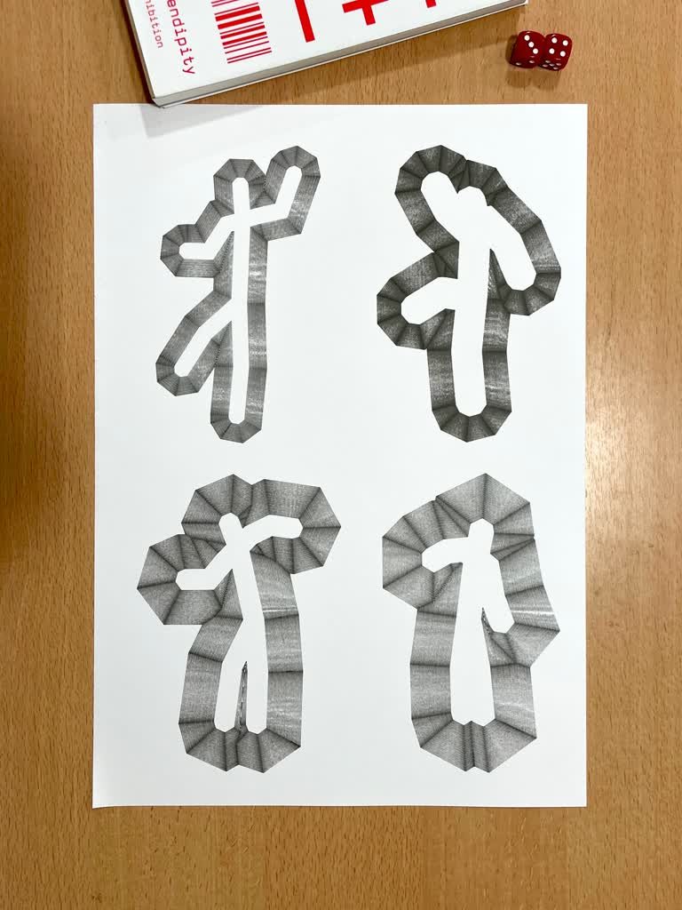
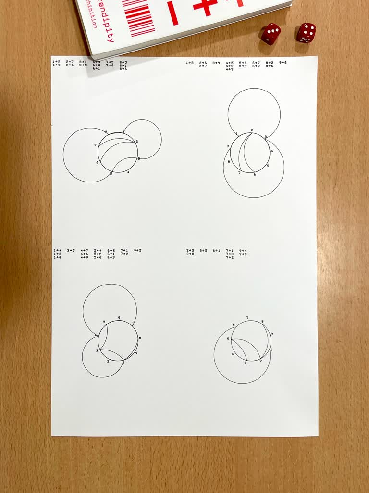
</p>

****

[Swann](https://swannymouton.com/) played with classic [Georg Nees' Schotter](https://collections.vam.ac.uk/item/O221321/schotter-print-nees-georg/), [Harold Cohen's "Three Behaviors for Partitioning Space"](http://dada.compart-bremen.de/item/artwork/332) and [Roger Coqart's Structured Square - Inwards](http://dada.compart-bremen.de/item/artwork/1264).
<p>
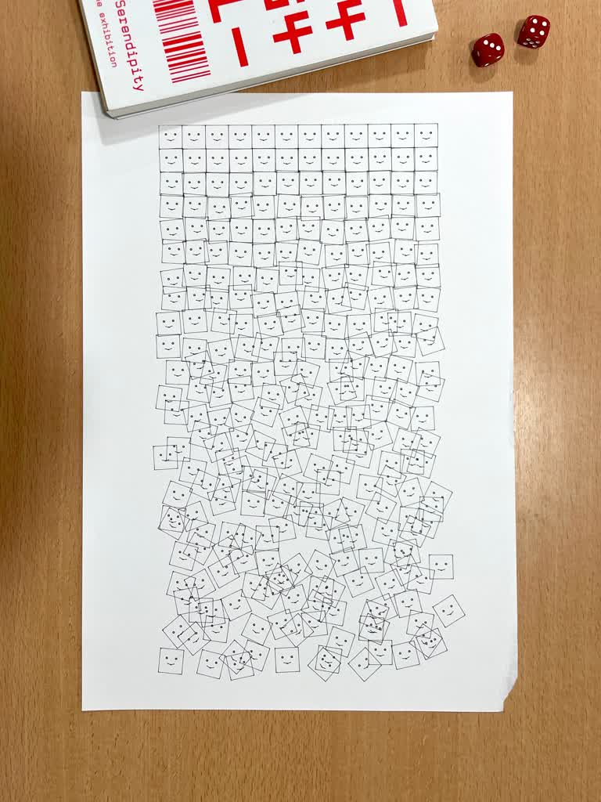
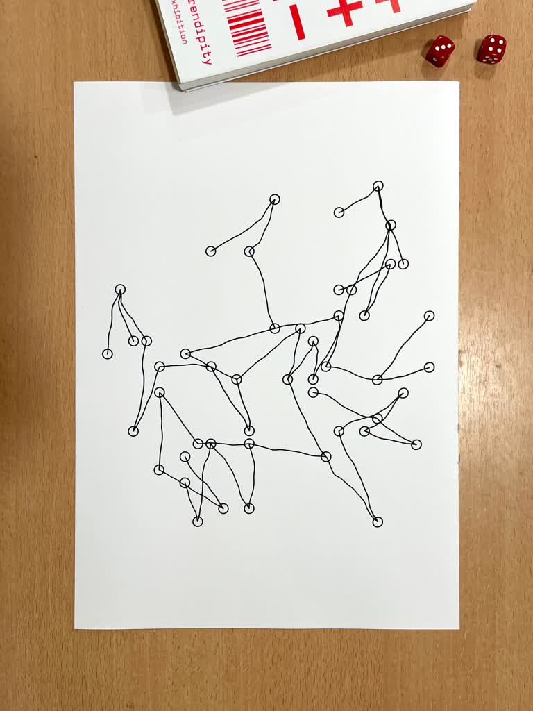
 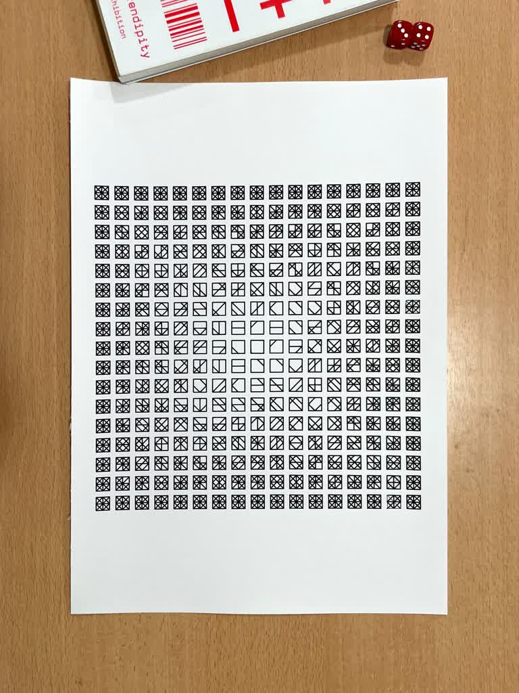
 </p>

****

Marine created a new artwork from [Aaron Marcus' Untitled 3](https://web.archive.org/web/20250623121916/http://recodeproject.com/artwork/v3n2untitled-3-marcus).
<p>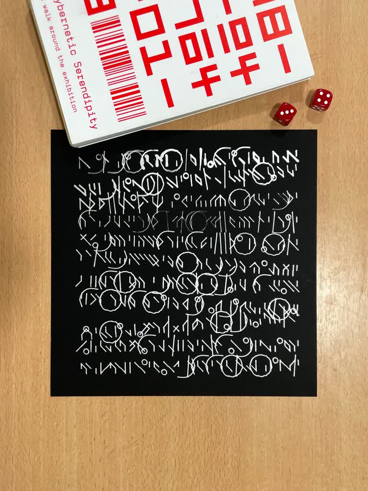</p>

****

Matthieu played with a custom algorithm and plotted it with a Roland DXY plotter.
<p>
 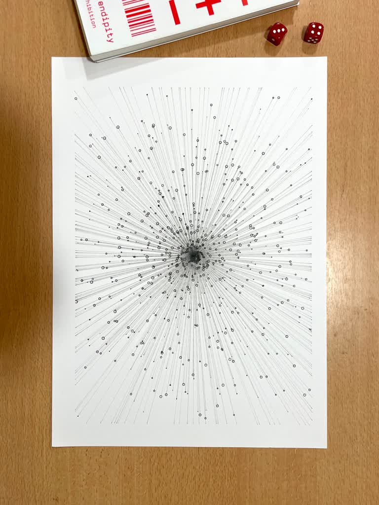
</p>

## Tools
* [Visual Studio Code](https://code.visualstudio.com/)
  * [p5.vscode](https://marketplace.visualstudio.com/items?itemName=samplavigne.p5-vscode)<br />*It helps you create p5.js projects in Visual Studio Code. It also includes autocompletion, a simple tool to browse and install third-party p5 libraries, and the Live Server extension.*   
* [vpype](https://github.com/abey79/vpype)<br />*Swiss-Army-knife command-line tool for plotter vector graphics*
* [Inkscape](https://inkscape.org/fr/release/inkscape-1.4.3/)
* [AxiDraw software installation](https://wiki.evilmadscientist.com/Axidraw_Software_Installation)
* **HTTP server** that comes with this repository to perform various tasks through an API :  
  * resize svg files with vpype.
  * transform svg to hpgl with vpype.
  * drive AxiDraw plotter.

### Server installation
This is not mandatory to install and run it for this workshop, though it is useful for easily manipulating svg and generating hpgl commands. 

#### Requirements
```python``` environment is needed to run the server.<br />
Note for Mac users : if ```python```does not work, replace with ```python3``` in the following commands.

#### Install and run
First we are going to create a virtual environment for the server.
In a terminal type the following commands : 
```bash
# Replace [path] with the appropriate location on your system
cd [path] 
```
```bash
python -m venv .venv
```

Then activate the virtual environment : 

**MacOS / Linux**
```bash
source .venv/bin/activate
```
**Windows**
```bash
.\.venv\Scripts\Activate.ps1
```

Once the virtual environment is activated, install the project’s dependencies listed in the ```requirements.txt``` file: 
```bash
pip install -r requirements.txt
```
That's it ! You should be able to run the server now.

### Server lauching
```bash
python ./server.py
```
If everything went fine, you should be able to open ```http://127.0.0.1:8080``` on your browser and navigate into the examples.

### p5.recoding library documentation
#### API Server
- [```vpype(strSvg, args=[])```](https://github.com/v3ga/Workshop_Recoding_Stereolux_2026/blob/9a57498b5b02a77d6e0d1dfdbbc6a4beab6a408e/sketches/libs/p5.recoding.js#L57)
- [```svgToHPGL(strSvg, opts={})```](https://github.com/v3ga/Workshop_Recoding_Stereolux_2026/blob/9a57498b5b02a77d6e0d1dfdbbc6a4beab6a408e/sketches/libs/p5.recoding.js#L80)

See 

#### Serial communication
```js
let serialCo = new SerialConnection();
let isConnected = await serialCo.connect();
if (isConnected){
  // ...
}
```

See [sketches/serial_connection](https://github.com/v3ga/Workshop_Recoding_Stereolux_2026/blob/main/sketches/serial_connection/sketch.js) for full example.

#### Roland-DXY plotter
```js
if (SerialConnection.isAvailable())
{
  serialCo = new SerialConnection();
  rolandDXY = new PlotterRolandDXY( serialCo );
}

```
See [sketches/send_to_roland_dxy](https://github.com/v3ga/Workshop_Recoding_Stereolux_2026/blob/main/sketches/send_to_roland_dxy/sketch.js#L82) for full example.

#### Saving files
- [```saveSvg(filename, strSvg)```](https://github.com/v3ga/Workshop_Recoding_Stereolux_2026/blob/9a57498b5b02a77d6e0d1dfdbbc6a4beab6a408e/sketches/libs/p5.recoding.js#L243)
- [```saveHPGL(filename, strHPGL)```](https://github.com/v3ga/Workshop_Recoding_Stereolux_2026/blob/9a57498b5b02a77d6e0d1dfdbbc6a4beab6a408e/sketches/libs/p5.recoding.js#L222)

See [sketches/vpype](https://github.com/v3ga/Workshop_Recoding_Stereolux_2026/blob/main/sketches/vpype/sketch.js#L36) for full example.

## Links
### Computer graphics & art magazines
* [From May 1976 to Feb. 1978](https://v3ga.net/computer_graphics_and_art_magazine/)
* [Magazines & more on Compart](http://dada.compart-bremen.de/search?query=computer+graphics+and+art)

### ReCode
* [The ReCode project](https://web.archive.org/web/20251006215316/http://recodeproject.com/)<br />*The ReCode Project is a community-driven effort to preserve computer art by translating it into a modern programming language (Processing)*
* [Zach Lieberman / Recreating The Past](https://rtp.media.mit.edu/)<br />*In Recreating the Past, we will study computational art from the past decades and recreate these works with contemporary techniques to gain aesthetic, analytical and technical knowledge.*
* [Yseul Song / Re-coded](https://yeseul.com/Re-coded)<br />*School for Poetic Computation studied five pioneers of computational media and recreated their projects using contemporary tools such as OpenFrameworks and Processing. We made about 50 pieces of sketches and displayed on two 9ft x 9ft LED walls.*
* [Lycée Le Corbusier à Strasbourg](https://www.lyceelecorbusier.eu/p5js/?page_id=2861)<br />*Collection of sketches*
* [Julien Gachadoat / Dessins géométriques et artistiques avec votre micro-ordinateur](https://github.com/v3ga/dessins_geometriques_et_artistiques)<br />*This repository presents programs written by french mathematician and computer scientist Jean-Paul Delahaye in the book "Dessins géométriques et artistiques avec votre micro-ordinateur" published in 1985 for the Eyrolles french publishing house.*
* [Julien Gachadoat / Nouveaux dessins géométriques et artistiques avec votre micro-ordinateur](https://github.com/v3ga/nouveaux_dessins_geometriques_et_artistiques)

### Plotters
* [Brian Boucheron / awesome-plotters](https://github.com/beardicus/awesome-plotters)<br />*A curated list of code and resources for computer-controlled drawing machines and other visual art robots.*
* [Julien Dorra / 3D printable plotter adapters for pens and refills](https://github.com/juliendorra/3D-printable-plotter-adapters-for-pens-and-refills)<br />*Use your favorite contemporary pens on vintage HP plotters with this parametric OpenSCAD code to create custom adapters.*
* [Golan Levin / p5.plotSvg](https://github.com/golanlevin/p5.plotSvg/)<br />*p5.js library for exporting SVG files tailored for pen plotting.*
* [Roland DXY-1300 -1200 -1100 Command Reference Manual](https://archive.org/details/rolanddxy130012001100commandreferencemanualaf)

### Random numbers generators
* [A Million Random Digits with 100,000 Normal Deviates](https://www.rand.org/pubs/monograph_reports/MR1418.html)<br />*Still the largest known source of random digits and normal deviates, the work is routinely used by statisticians, physicists, polltakers, market analysts, lottery administrators, and quality control engineers.*
* [List of random number generators](https://en.wikipedia.org/wiki/List_of_random_number_generators)<br />*Random number generators are important in many kinds of technical applications, including physics, engineering or mathematical computer studies.*
* [prng](https://github.com/dworthen/prng)<br />*A collection of better PRNGs*

### History
* [v3ga / Computer & Computer art history](https://github.com/v3ga/computer_history)<br />*A set of links related to computer & code history (english and french links)*
